# 基于运动特征和随机森林模型的鸟类与无人机目标分类：使用监视雷达数据

收稿日期：2021年10月27日；录用日期：2021年11月17日；发布日期：2021年11月23日；当前版本日期：2021年12月9日。

数字对象唯一标识符（DOI）：10.1109/ACCESS.2021.313023

**JIA LIU**1、**QUN YU XU**2 和 **WEI SHI CHEN**3

1 北京航空航天大学前沿科学研究院，中国北京 100191；2 中国民航科学技术研究院民航法律、法规与标准化研究所，中国北京 100028；3 中国民航科学技术研究院机场研究所，中国北京 100028

通信作者：Jia Liu（jialiu9941@foxmail.com）

本研究部分得到北京航空航天大学卓百计划（项目编号 ZG216S2182）、国家重点研发计划（项目编号 2016YFC0800406）、国家自然科学基金委员会（NSFC）与中国民用航空局（CAAC）联合资助项目（项目编号 U1933135 和 U1633122）的支持。

## 摘要

在各种低空空域监视场景中，对鸟类和无人机进行准确探测与跟踪具有重要意义。当前，雷达是解决该问题最适合的远距离监视技术，但如何有效区分鸟类与无人机仍面临诸多困难。本文研究鸟类和无人机固有的飞行力学与行为模式，通过从雷达航迹中提取目标运动特征，提出一种目标分类方法，并在新的特征空间中选用随机森林模型进行目标分类。所提方法通过部署在机场区域的实用型鸟类监视雷达系统进行了验证。鸟类、四旋翼无人机和动态降水杂波的分类结果表明，该方法能够取得较好的分类精度。随机森林模型中的基尼重要性描述量还可为运动特征的评估与挖掘提供额外参考。较高的样本适应性和运行效率使该分类系统能够处理复杂的低空目标监视与分类问题。本文还讨论了现有方法的局限性及潜在的优化策略，并将其作为未来研究方向。

**关键词：** 目标探测；雷达跟踪；目标分类；特征提取；机器学习

## I. 引言

近年来，无人驾驶飞行器（UAV）取得了快速发展。作为无人机家族中的重要分支，多旋翼无人机具有独特的平台优势，能够为多种应用场景提供创新解决方案 [1]。然而，小尺寸、低成本和部署灵活等优点，也会在特定区域带来不可忽视且难以预测的安全威胁。因此，出于安全考虑，有必要对非合作无人机进行有效监视 [2]，[3]。

低空监视雷达被认为是远距离监视无人机最合适的技术方案 [4]，具有远距离探测、跟踪以及全天候运行等优势。但与传统非合作目标不同，无人机尺寸较小，且多采用非金属材料制成，因此雷达散射截面（RCS）较小；其低空飞行能力也使其雷达可探测性很低 [5]，[6]。在许多典型监视环境中，还存在另一类低空非合作目标，即鸟类。已有研究表明，无人机与鸟类的雷达回波具有较高相似性 [7]–[9]，这给从雷达角度区分无人机与鸟类带来了很大困难。此外，地杂波、多径效应和降水等干扰进一步增加了无人机目标分类的难度 [10]–[12]。因此，在实际监视场景中，要实现有效的非合作无人机监视，必须准确区分无人机、鸟类以及静态和动态杂波等环境干扰。

相关研究发现，飞行器的螺旋桨等运动部件能够在幅度和相位上调制雷达回波，并可从这种调制信号中提取微多普勒特征（MDS），作为雷达目标的附加特征 [13]，[14]。仿真结果表明，四旋翼无人机回波中存在清晰的 MDS，可作为具有代表性的目标特征。相关研究 [5]，[15]–[18] 利用 MDS 提取均值谱、奇异值分解（SVD）的第一左奇异向量、均值步频速度图（CVD）等目标代表性特征，并将这些特征与支持向量机（SVM）等常用分类器结合，实现了有效的无人机目标识别。非刚性鸟类的翅膀扑动同样会调制雷达回波并产生 MDS；鸟类特有的扑翼模式会形成具有辨识度的 MDS，可用于目标分类 [19]–[21]。

但是，现有基于 MDS 的成果大多建立在理论仿真、室内测量或近距离（<200 m）室外测量的基础上。在实际监视场景中，如何在远距离条件下有效提取 MDS 仍存在争议。实验还表明，滑翔鸟和采用塑料旋翼的无人机通常呈现不明显的 MDS 和较弱的 RCS 调制。对于无人机群或鸟群等群体目标，其在雷达扫描空间内的相互耦合会进一步复杂化雷达回波的幅度和相位调制，从而很难有效提取 MDS。MDS 的另一项局限是：为获得足够的相干积累，需要在特定目标上保持较长驻留时间 [22]，这与雷达面向多目标探测和跟踪的扫描模式相冲突。因此，MDS 是一种有前景的雷达目标特征，但其在实际监视场景中的应用价值仍需进一步提升。由于当前 MDS 技术在远距离无人机监视中的适用性仍存疑问，目标分类还需要其他目标特征的支持。

除 RCS 外，极化特征也是窄带雷达的一类代表性目标特征。在文献 [23] 中，研究人员提取了九种极化特征，并采用最近邻分类器实现了有效的目标分类。然而，该工作基于仿真结果，其实际性能仍需通过外场实验进一步验证。此外，交叉极化测量也会增加雷达系统的硬件要求，系统复杂度与监视性能提升之间的权衡仍需进一步平衡。

尽管鸟类和无人机在飞行过程中表现出高度相似的雷达回波特征，但二者在飞行力学和机动模式方面仍存在内在差异。因此，飞行运动特征可能为目标判别提供额外信息 [24]。从雷达系统角度看，目标运动以航迹形式离散表示，航迹中的每个检测点包含空间、时间、信号强度和多普勒信息。基于仿真平台的已有研究初步验证了利用雷达航迹统计特征区分鸟类和无人机的可行性 [25]。近期基于外场实验的研究进一步验证了利用由动态描述量构成的新特征空间进行目标判别的潜力 [26]。因此，航迹运动特征对于无人机识别具有良好前景，但现有方法大多基于仿真数据或理想采样的目标航迹。在分类方法开发中，仍需研究环境鲁棒性以及对较高样本质量不确定性的适应能力，以确保其应用价值。

本文介绍一种利用从航迹中提取的运动特征进行无人机目标分类的方法，研究鸟类与无人机在飞行力学和行为模式方面的差异，并提出五种动态描述量用于目标特征描述。采用随机森林模型对无人机、鸟类和动态降水杂波进行分类。所提方法通过中国民航科学技术研究院（CAAC）部署在北海机场区域的鸟类监视雷达系统采集的外场实验数据集进行了验证。三类目标的总体正确分类率高于 85%。所提方法无需对雷达硬件或信号处理器进行额外改造，因此在各种雷达监视系统中具有较大的灵活性和通用性。分类过程中不采用 RCS 和 MDS 特征，使该方法不依赖雷达标定、雷达工作模式及其他环境干扰因素。较低的计算复杂度保证了实时分类性能。随机森林模型中的基尼重要性描述量还可为评估各描述量对分类的贡献提供额外参考，有助于理解目标运动特征并开发新的描述量。

本文结构如下：第二节讨论鸟类与无人机在飞行机制和行为模式方面的差异，为运动特征挖掘提供依据；第三节介绍五种描述量，用于构建目标分类的新特征空间；第四节说明选择随机森林模型作为分类器的原因以及实验设置；第五节从多个方面讨论分类结果和所提方法存在的问题。

## II. 飞行力学与行为分析

尽管鸟类和无人机在飞行速度及雷达回波特征方面具有较高相似性，但从视觉观察角度看，二者的飞行模式仍然不同。这种视觉差异源于二者在飞行力学和行为模式上的内在差异。在雷达系统中，飞行目标由包含空间和时间信息的航迹描述，其运动特征通过一系列目标检测点离散表示。本节对鸟类和无人机的飞行力学与行为模式进行初步讨论，为后续特征挖掘提供依据。

### A. 飞行力学

无人机通过控制桨叶旋翼获得升力，从而实现前进、后退、上升、下降和悬停等不同机动。固定翼无人机的设计会充分考虑空气动力学，而对于多旋翼无人机而言，空气动力学的主导作用不如固定翼无人机明显。相比之下，鸟类属于非刚性目标，通过扑动翅膀获得动力，并通过调整身体形态、姿态和扑翼模式来完成机动。空气动力学在鸟类机动中占主导地位；由于鸟类的非刚性特性，其机动过程通常比无人机更加复杂。图 1 对两者的飞行力学进行了直观示意。

从理论上讲，由于旋翼桨叶控制具有更高的自由度，无人机能够实现更加复杂的机动模式。鸟类通常表现出平滑的飞行轨迹；只有在特定的强风条件下，鸟类才可能偶尔在空中悬停。因此，即使鸟类和无人机具有相近的飞行速度，其固有飞行力学差异也使二者很难完全复现对方特有的机动模式。图 2 展示了无人机在几种常见工作场景下四条代表性飞行轨迹的地面投影，空间信息由 GPS 设备提供。显然，轨迹 B 和 D 是无人机常见的规则机动模式，但鸟类很难完成。

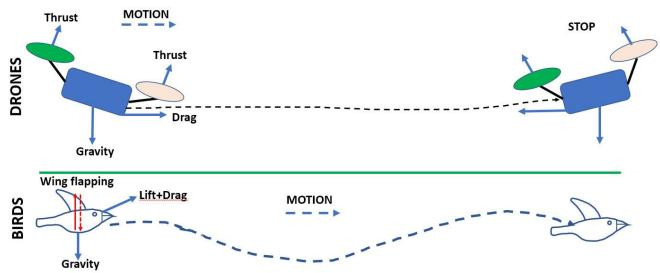  
图 1. 鸟类和无人机飞行力学示意图。

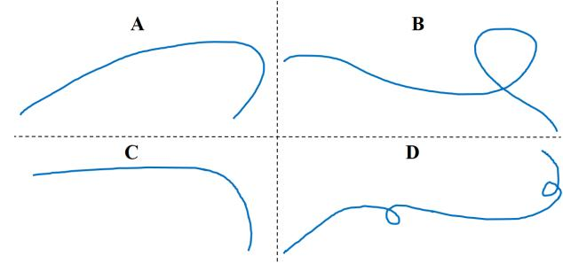  
图 2. 无人机代表性飞行轨迹投影。

### B. 行为模式

从行为模式角度看，无人机是人工目标，其飞行通常由执行监视、配送等特定任务驱动。因此，无人机的行为模式是任务需求与操作者控制偏好的组合。相比之下，鸟类是具有自主智能的典型非合作目标，其行为与生活习性和物种密切相关。例如，迁徙鸟类和留鸟具有明显不同的行为模式；同一物种的鸟类在觅食、栖息等活动中也可能表现出多样化的机动模式。因此，考虑到鸟类物种数量众多且生活习性多样，鸟类拥有远比无人机丰富的行为模式。这种丰富性会反映在检测点所包含的空间—时间信息及各种运动特征中，无人机也很难完全复现。

总的来说，无人机在机动方面具有更高的自由度，而鸟类拥有更加复杂的行为模式。这使鸟类与无人机难以完全复现彼此的飞行模式，其差异会反映在雷达航迹包含的运动特征中。每个检测点所包含的空间和时间信息，为挖掘运动特征提供了可能。

## III. 雷达目标航迹中的运动特征建模与提取

在监视雷达系统中，航迹是描述被探测运动目标最基本的要素。当累积了足够多的检测结果后，系统便会建立一条航迹（在本文系统中，连续四次扫描中有三次检测到目标即可建立航迹）。在航迹关联过程中，航迹中可能包含“漏检”，即维持暂态航迹的外推目标。系统软件允许连续最多三次漏检；如果目标连续四次扫描均漏检，则终止该航迹。每条航迹都被分配一个航迹 ID，航迹中的每个检测点包含时间和位置信息。通过相邻航迹点可以推导目标航向及相应的飞行速度。即使存在一定偏差，只要能够保证较高的雷达扫描速率，依据离散航迹点推导的速度和方向信息仍可较好地近似描述目标运动。

但是，直接使用速度和航向信息存在以下局限性：（1）不同航迹的长度（检测点数量）通常差异很大，导致特征向量维度不一致；（2）速度和航向分别描述空间维度和时间维度上的一阶运动特征。因此，需要进一步挖掘隐藏在航迹空间—时间信息中的运动特征，构建维度统一的新特征空间。

本文从航迹的速度和航向信息中提取五种描述量。由这五种描述量组成新的特征向量，并将其应用于学习机，实现目标分类。由 N 个检测点组成的航迹可以数学表示为向量

$$
\mathbf { Z } = [ Z _ { 1 } , Z _ { 2 } , \ldots \ldots , Z _ { \mathrm { N } } ]。
$$

符号 $Z _ { \mathrm { i } }$ 表示第 $i$ 个检测点。相应的速度和航向信息分别以向量形式表示为 $\mathbf { V } = [ \nu _ { 1 } , \nu _ { 2 } , \dots , \nu _ { \mathrm { N } } ]$ 和 $\mathbf { \Omega } = [ h _ { 1 } , h _ { 2 } , . . . , h _ { \mathrm { N } } ]$。速度和航向的单位分别为 m/s 和度。0° 表示正北方向，90° 表示正东方向。以下小节定义五种描述量。

### A. 平均速度

平均速度定义为：

$$
v _ {\mathrm{mean}} = \frac {1}{N} \sum_ {i = 1} ^ {N} v _ {i}\tag{1}
$$

平均速度描述航迹的总体速度水平，是最基本的运动描述量。除悬停情况外，鸟类和无人机通常具有接近的平均速度。降水杂波的速度取决于风场和降水强度，通常低于鸟类。平均速度适用于区分速度差异明显的目标，例如鸟类与地面车辆。然而，该描述量通常不会在目标分类中发挥主导作用，一般作为基础描述量，与其他运动描述量联合使用。

### B. 速度标准差

大多数航迹的检测点之间通常存在速度偏差。偏差程度反映目标运动在空间和时间上的不确定性。航迹速度标准差定义为：

$$
v _ {s t d} = \sqrt {\sum_ {i = 1} ^ {N} \frac {(v _ {i} - v _ {m e a n}) ^ {2}}{N}}\tag{2}
$$

标准差越大，表明速度不确定性越高。鸟类航迹通常表现出较小的速度变化，出现高速度不确定性的概率较低。降水杂波速度与风场一致，在大多数情况下，其速度变化曲线较为平滑。由于具有较高的机动灵活性，无人机能够呈现更宽范围的速度偏差模式：在巡航模式下速度变化平滑，但在许多场景中也能够表现出较大的速度不确定性。操作者的控制偏好同样会影响速度特征。因此，鸟类和无人机固有的运动差异使速度不确定性包含更加明显的判别信息。

### C. 航向标准差

与速度信息不同，航迹的平均航向与目标运动本身的关系较小。但航向偏差模式可以用于描述目标的相对空间不确定性。航向标准差定义为：

$$
h _ {s t d} = \sqrt {\sum_ {i = 1} ^ {N} \frac {\Delta_ {h} (i)}{N}}\tag{3}
$$

考虑到航向的定义，$\Delta _ { h }$ 定义为：

$$
\Delta_ {h} (i) = \left\{ \begin{array}{l l} (h _ {i} - h _ {m e a n}) ^ {2} & | h _ {i} - h _ {m e a n} | \leq \delta_ {h} \\ (| h _ {i} - h _ {m e a n} | - 3 6 0) ^ {2} & | h _ {i} - h _ {m e a n} | > \delta_ {h} \end{array} \right.\tag{4}
$$

其中，$h _ {\mathrm { m e a n } }$ 表示平均航向，其计算考虑了 0° 与 360° 之间的周期关系。$\delta _ { h }$ 为航向偏差阈值，经验上设定为 90°。鸟类的航向偏差与其行为关系更为密切。留鸟通常比迁徙鸟表现出更大的空间不确定性。考虑到鸟类的机动能力，其整体航向偏差小于无人机。无人机有时会表现出鸟类难以复现的特定机动行为，相应的航向偏差也具有明显特征。大多数降水航迹的航向变化较为一致，标准差较小；除受阵风干扰外，突发性的航向变化较为少见。

### D. 机动性因子

航向标准差描述了目标的空间不确定性，但其与时间信息的相关性较弱。速度特征描述了目标在时间域中的标量变化，但其与目标空间不确定性的关系并不明确。因此，前述三个描述量分别独立地表示目标在相应维度上的运动特征。通过大量分析可以发现，目标会随速度变化呈现多样化的航向变化。当目标能够在高速状态下产生较大的航向偏差时，可认为其机动性较强。这是对目标运动的联合维度描述。机动性因子定义为：

$$
\sigma = v _ {m e a n} ^ {\prime } / h _ {s t d} ^ {\prime}\tag{5}
$$

机动性因子的单位为 m/sec/deg，用于描述单位航向偏差下的目标运动速度。由于速度和航向偏差在数值上存在明显差异，$\nu _ { m e a n } ^ { \prime }$ 和 $h _ { s t d } ^ { \prime }$ 是依据预先设定的数值范围归一化得到的值。根据现有航迹样本，平均速度和航向偏差的取值范围分别为（2–20）m/s 和（0–90）°。根据式（5），如果目标能够在高速状态下产生较大的航向偏差，则表现出较强的机动性，相应的 $\sigma$ 值会落在某个特定的较小范围内。

鸟类的机动性与其物种和行为模式密切相关。迁徙鸟类通常不会产生突发性运动，机动性较弱；留鸟拥有更加多样的行为模式，在觅食、栖息等活动中可能偶尔表现出较强机动性。由于无人机能够在空中悬停，其机动性因子的变化范围更大，并且与具体任务密切相关。降水航迹的机动性完全取决于风场，在大多数情况下，动态降水杂波航迹的机动性较弱。数值结果表明，对于具有不同航向偏差特征的高速和低速目标，$\sigma$ 值均分布在某个特定范围内，这有利于在特征空间中分离具有不同机动模式的目标。但需要注意的是，这种机动性描述是针对某一条具体目标航迹的，并不代表目标本质上的机动能力。

### E. 振荡因子

振荡因子通过提供更加全面的动态特征描述，对机动性因子进行进一步补充。其提出源于一个目标区分中的混淆问题：图 3（a）和图 3（b）展示了两条航迹的地面投影。航迹 1 和航迹 2 均由标记为 A 至 I 的九个检测点组成。

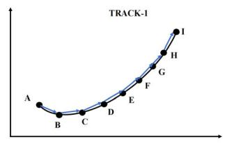

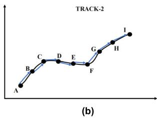  
图 3. 具有不同运动模式的航迹投影：（a）航迹 1；（b）航迹 2。

航迹 1 代表大多数鸟类航迹，其动态特征平滑且一致。由于振荡模式复杂，航迹 2 在鸟类和降水航迹中较为少见；但对无人机而言，这种模式并不难实现，在不可预测的环境干扰下也经常出现。然而，前面小节定义的描述量并不能全面反映这一显著差异。矛盾源于标准差中的绝对值运算。绝对值描述的是不带变化方向的标量变化量，对绝对偏差求和会将运动描述限制在局部尺度内，由交替偏差方向引起的航向振荡无法得到有效反映。因此，本文提出振荡因子，用于补充航向偏差描述。

振荡因子的计算首先需要获得航向偏差的方向信息。偏差方向由相邻检测点之间航向角差的符号确定，定义为 $\tau _ { h } \left( k \right) = h _ { k + 1 } - h _ { k }$。考虑雷达测量误差，阈值 $\delta _ { e }$ 定义为 0.5。对于检测点 $Z _ { k }$，其航向偏差符号定义为：

$$
X _ {h} (k) = \left\{ \begin{array}{l l} 1 & \tau_ {h} (k) > \delta_ {e} \\ 0 & | \tau_ {h} (k) | \leq \delta_ {e} \\ - 1 & \tau_ {h} (k) < - \delta_ {e} \end{array} \right.\tag{6}
$$

根据式（6）可构造航向偏差符号向量，例如记为 $\mathbf { O } = [1,-1,0,1,\ldots]$。由向量 $\mathbf O$ 定义两种振荡模式：

$$
\begin{array}{c} \text{模式 1： } \mathbf{O}(i-1)+\mathbf{O}(i)=0 \text{，且 } \mathbf{O}(i-1)\neq\mathbf{O}(i)；\\ \text{模式 2： } \mathbf{O}(i-1)+\mathbf{O}(i+1)=0 \text{，且 } \mathbf{O}(i-1)\neq\mathbf{O}(i+1)，\\ \mathbf{O}(i)=0； \end{array}
$$

如果存在上述两种振荡模式之一，则从初始检测点重新开始遍历，振荡计数器加 1，并记录相应的航向偏差 $\tau _ { h } \left( k \right)$。如果一条航迹中存在 $K$（$K>0$）次振荡，则相应的振荡因子计算为：

$$
\zeta = \sum_ {k = 1} ^ {K} w (k) \times | \tau_ {h} (k) |\tag{7}
$$

式（7）中的 $w(k)$ 是第 $k$ 次振荡的加权因子，其定义见表 1。对于特定航迹，振荡次数越多，通常表示振荡模式越强。加权因子用于表示振荡次数增加带来的影响增长。将其应用于航向偏差角，可以描述航迹整体的振荡程度。振荡因子的单位为度，数值越大表示航迹振荡越强。

需要指出的是，表 1 中的振荡编号 $k$ 指当前航迹遍历过程中的第 $k$ 次振荡，而不是振荡总次数。例如，振荡编号 3 表示当前航迹遍历中的第三次振荡，其对应的航向偏差角需乘以权重因子 2。递增的权重因子表示振荡次数增加所带来的影响不断增强。但是，当前权重因子的定义具有经验性和主观性。未来可通过数值回归或统计拟合更加合理地确定权重因子。

**表 1. 权重因子定义。**

| 振荡编号 | 权重 |
|---:|---:|
| 1 | 1 |
| 2 | 1.5 |
| 3 | 2 |
| 4 | 3 |
| ≥5 | 5 |

## IV. 监督学习模型与实验设置

### A. 随机森林分类模型

根据第三节定义的描述量，一条目标航迹可以由新的特征向量表示：

$$
\mathbf {S} = [ v _ {m e a n}, v _ {s t d}, h _ {s t d}, \sigma , \zeta ]\tag{8}
$$

该特征向量从多个方面包含目标运动特征，且维度统一，适合应用于学习机模型进行目标分类。本文从雷达观测数据中选取带标签的特征向量，构建训练数据库，并采用监督学习策略。未知目标航迹被转换为式（8）所示的特征向量，再输入训练好的分类器以确定目标类型。因此，有必要选择适当的学习机。现有的支持向量机（SVM）、人工神经网络（ANN）等模型都可以用于该任务，但学习机的选择应考虑具体分类问题和特征向量的内在属性。本文选用随机森林模型作为学习机。

随机森林模型是一种具有代表性的机器学习技术 [27]，是一种基于多棵决策树的集成分类策略。其基本原理是从特征空间中随机选择部分特征，构建多棵决策树。各棵树的决策过程相互独立，最终通过对所有树的结果进行加权集成作出决策。该过程如图 4 所示。

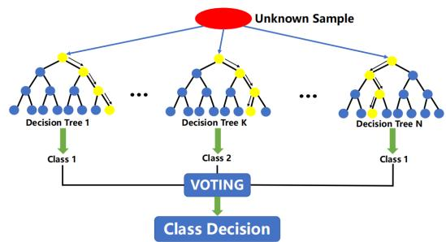  
图 4. 随机森林模型示意图。

随机森林模型的原理和实现都比较简单，对于本文问题而言，分类平台的开发并不困难。但仍有必要全面说明选择随机森林作为学习机的原因。

1. 与在完整特征空间上运行的其他机器学习技术不同，随机森林中的特征选择和决策树构建策略使其具有良好的噪声容忍能力，并降低了过拟合的可能性 [28]。在本文问题中，尽管雷达系统能够准确探测和跟踪鸟类，但环境干扰和跟踪算法不确定性会使训练数据库中部分包含低质量的非鸟类航迹，这些航迹被归为噪声干扰。因此，随机森林适合处理样本质量存在不确定性的训练数据库。

2. 如式（8）所示，五种描述量被整合到一个特征向量中，但这些描述量在本质上相互独立，其维度和物理含义并不一致。这可能给其他学习机带来不便，但对随机森林并不是问题。作为基本组成单元，决策树无需特征归一化即可自然适应定量和定性特征。因此，随机森林能够较好地处理不一致的特征空间。此外，当引入或重新排列额外目标特征时，随机森林对特征变化具有较高灵活性。

3. 与许多常用机器学习技术相比，随机森林模型的计算和内存消耗较低。由于不同季节和地点的鸟类物种及行为模式差异很大，有必要针对不同场景频繁调整训练数据库。随机森林在效率和灵活性方面的优势适合这些要求。

4. 基尼重要性也是选择随机森林模型的重要原因。作为特征重要性的定量描述量，基尼重要性能够为特征选择提供有用参考 [29]。在本文问题中，虽然提出了五种描述量，但各描述量对分类的贡献缺乏定量评价指标。作为补充，基尼重要性能够直观、定量地解释各特征的相对重要程度，为特征选择提供参考。

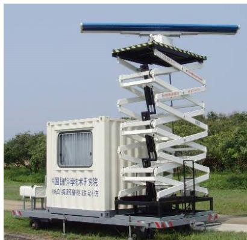  
图 5. 中国民航科学技术研究院研制的鸟类监视雷达系统。

### B. 实验设置

雷达数据来自中国民航科学技术研究院研制的鸟类监视雷达系统，如图 5 所示。该系统由一个恒温控制舱和两座天线塔组成。恒温舱内安装计算机系统、数据处理器和无线数据传输设备；两座塔上安装具有垂直和水平扫描能力的双扫描阵列天线。雷达工作在 S 波段。水平扫描天线安装在高度可调的塔架上。垂直和水平扫描均采用固态放大器，峰值功率为 0.4 kW。雷达转速为每分钟 25 转（每次扫描 2.4 s）。鸟类探测与跟踪算法具有实时可视化功能 [30]。

该雷达部署于中国广西省北海市富城机场，部署详情如图 6 所示。区域 A 和 B 是本地鸟类活动密集区，也是雷达观测数据的主要来源；区域 C 被选为无人机飞行测试场。数据采集时间为 2019 年 9 月初至 10 月底。鸟类观测数据在天气良好条件下，于当地时间 7:00 至 19:00 采集，并通过目视观测进行交叉验证。无人机航迹来自区域 C 的实际飞行。为最大限度降低潜在风险，所有无人机飞行实验均安排在清晨或夜间、没有飞机起降的时段进行。实验使用的无人机型号为 DJI Phantom 3。无人机飞行计划用于模拟录像、巡航、多角度拍照、悬停等多种工作模式。

根据 GPS 信息发现，当无人机在空中悬停超过 15 s（6 次雷达扫描）时，雷达航迹会停止关联。在其他呈现不同机动模式的情况下，系统能够有效捕获无人机并生成航迹。在本文实验中，单架无人机被雷达系统视为中等体型鸟类。历史观测数据表明，随风移动的降水可能产生大量虚假鸟类航迹 [31]。降水航迹采集于 9 月选定的两个中等降水量日期。观测结果表明，当降水以较为均匀的模式移动时，具有足够回波强度的密集降水区域会被认为是以一致速度和方向飞行的鸟类 [32]。数据采集期间风速约为 10 m/s。降水数据采集期间的外场观测确认鸟类活动可以忽略不计。

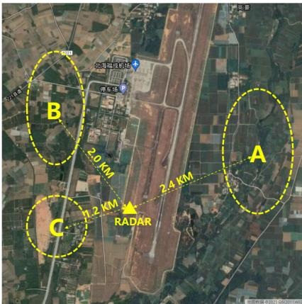  
图 6. 北海机场雷达部署地理示意图。

需要对目标航迹进行预处理。长度较短的航迹（少于 4 个检测点）被忽略。长度较长的航迹（超过 20 个检测点）较为少见，且由于检测点关联错误，有时会包含低质量数据，因此同样被滤除。振荡次数过多的航迹主要由杂波干扰和跟踪算法关联错误造成，因此将最大振荡次数设为 7。由于建筑遮挡和杂波干扰，平均高度低于 50 m 的航迹被移除。训练数据库和测试数据库采用随机选择算法构建，且不包含重复样本。训练数据库中鸟类、无人机和降水航迹的样本数分别为 927、635 和 1385；测试数据库中相应样本数分别为 217、184 和 239。无重复采样策略使样本重复率为 0%。

## V. 结果与讨论

### A. 可分性分析

首先验证训练样本的可分性，以探究分类性能的潜力。由于特征空间为五维，很难直观观察原始特征空间中的样本可分性。因此，采用主成分分析（PCA）技术，从特征向量中提取前两个主导主成分。图 7 展示了三类目标特征向量前两个主成分的投影，可以直观看到三类目标之间的可分性。其中，无人机航迹与降水航迹之间的可分性最为明显，体现了无人机与风场之间固有运动特征的差异。图 7 中鸟类样本分布更为宽泛，说明鸟类具有更加丰富的运动多样性。

鸟类航迹与无人机航迹或降水航迹之间也存在重叠样本。本文进一步提取这些样本进行分析。与降水航迹重叠的鸟类航迹具有简单的飞行轨迹，可归类为小型鸟群；与无人机重叠的鸟类航迹具有较强机动性和轻微振荡。此外，可以观察到图 7 中鸟类和无人机样本呈现聚类模式。利用 k-means 算法可以找到每类样本的聚类中心。无人机聚类中心附近的样本大多是具有图 2 中轨迹 B 和 D 所示机动性的航迹，这些航迹来自执行视频或照片采集任务的无人机。因此，图 7 所示的可分性分析增强了利用随机森林模型实现有效目标分类的信心。

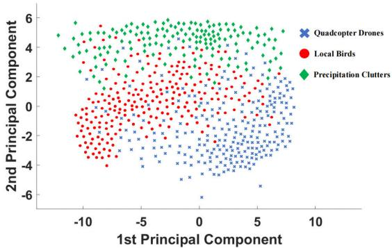  
图 7. 三类目标的主成分分布。

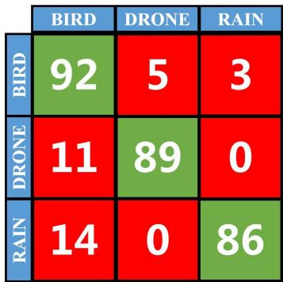  
图 8. 五折自验证实验的混淆矩阵。

### B. 自验证

在将训练好的分类器用于未知样本分类之前，有必要验证其质量。通常采用五折交叉验证策略进行验证。图 8 给出了交叉验证结果的混淆矩阵，其中矩阵内容表示正确分类率。绿色方块表示正确分类，红色方块表示错误分类。正确分类率超过 85%，表明构建的随机森林分类器具有可接受的质量。

在许多地区，动态降水杂波干扰较小。因此，在更加普遍的监视场景中，分类器仅区分无人机和鸟类的能力更具吸引力。为验证这一性能，排除降水航迹后重新构建训练数据库，并训练新的随机森林模型。相应的混淆矩阵如图 9 所示。正确分类率仅发生轻微变化，分类器整体质量仍足以提供令人满意的分类精度。

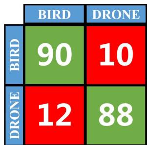  
图 9. 排除降水后的自验证混淆矩阵。

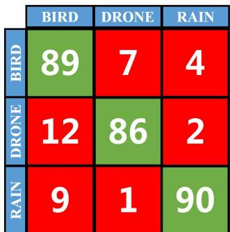  
图 10. 三类目标分类的混淆矩阵。

### C. 精度与效率讨论

在所提分类系统中，未知目标航迹由特征向量中的五种描述量表示，再输入随机森林模型以确定目标类型。分类精度仍通过混淆矩阵中的分类率进行量化，如图 10 所示。三类目标的平均正确分类率高于 85%，基本能够满足应用要求。无人机与降水航迹之间的误分类率接近于零，这与图 7 所示二者之间的显著差异一致。被误分类的鸟类和无人机航迹具有平滑的运动特征，其地面投影轨迹与图 2 中的轨迹 C 高度相似，因此缺少可用于有效分类的显著特征。

通过排除降水样本，进一步研究鸟类与无人机之间的区分能力。图 11 中的混淆矩阵与图 10 相比，正确分类率几乎没有变化。这也表明，在无人机目标识别问题中，鸟类是主要干扰来源。此外，根据图 6，所有航迹均采样于大于 1 km 的雷达探测距离范围内，证明所提方法能够在雷达监视模式下实现远距离无人机识别。

与无人机不同，鸟类和降水的运动特征与动态环境密切相关。因此，即使在同一监视区域内，它们在不同季节也可能表现出不同的行为模式。这要求监视系统适当调整训练数据库，以准确建模运动模式。分类模型还需要对训练数据库的修改具有良好的适应性。为验证这一点，将训练数据库与测试数据库合并，构建新的随机森林建模数据库，并进行五折交叉验证实验，结果如图 12 所示。分类性能仅发生轻微变化，说明随机森林模型具有良好的鲁棒性。但需要指出的是，由于样本数量有限，这种鲁棒性验证并不十分全面。

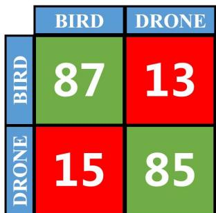  
图 11. 鸟类与无人机分类的混淆矩阵。

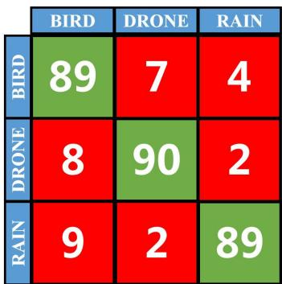  
图 12. 合并测试数据库和训练数据库后的自验证混淆矩阵。

对于非合作无人机监视系统而言，分类效率至关重要。随机森林模型的低复杂度和特征向量的低维度，使分类系统具备高效目标分类能力。本文采用 Python 语言开发随机森林模型，计算机配置为 Intel i5-7500 CPU 和 16 GB RAM。由于训练样本数量有限，训练过程仅耗时 17.1 s；对于单条目标航迹，系统完成目标类别评估耗时 0.27 s。因此，该系统基本能够实现实时目标识别。精度、鲁棒性和效率方面的结果表明，所提分类模型具有良好的应用价值。

### D. 基尼重要性讨论

由于基尼重要性对特征选择具有重要贡献，有必要对其进行进一步讨论。图 13 和图 14 展示了不同分类问题中的基尼重要性分布。数值越大，表示特征重要程度越高。在两种分类问题中，机动性因子均具有最大的基尼重要性，说明目标之间存在显著的机动能力差异。相比之下，平均速度对分类的贡献较小，这与经验分析结果一致。

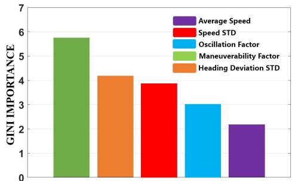  
图 13. 鸟类—无人机—降水分类中的基尼重要性。

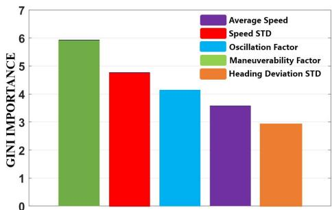  
图 14. 鸟类—无人机分类中的基尼重要性。

排除降水杂波后的基尼重要性评估结果如图 14 所示。与图 13 相比，最显著的差异是航向标准差的重要性下降为最低。这说明航向偏差在区分降水与另外两类目标时发挥主导作用。另一方面，鸟类和无人机在飞行过程中都可能产生较大的航向偏差，但二者的偏差模式很难通过航向标准差反映出来，因此该特征在随机森林中的重要性下降。相比之下，振荡因子弥补了这一缺陷，其基尼重要性在鸟类与无人机目标的区分中得到提升。

上述讨论表明，基尼重要性对运动特征的描述与经验评价得出了相一致的结论。基尼重要性的定量属性有助于进一步理解目标运动特征，并为新特征的挖掘提供参考。

### E. 问题与未来工作

本节结果验证了所提特征提取与分类方法的有效性，但现有工作仍存在局限，也具有进一步改进的潜力。

1. 从航迹信息中提取的目标运动特征高度依赖跟踪精度。对现有数据库的分析表明，当大规模鸟群以非均匀模式飞行并穿越多个分辨单元时，航迹可能发生畸变，进而导致跟踪过程中的关联算法出错。畸变航迹通常表现出不一致的运动模式，对分类精度产生不利影响。解决这一问题的潜在方案是将关注重点从单条航迹转移到群体航迹。提取并利用与群体目标相关的多尺度运动特征，可能改善跟踪和分类性能。

2. 本文所提方法仅利用目标运动特征进行特征描述，没有采用 RCS 等雷达回波特征。这使该方法能够应用于因数据安全或访问限制而无法提供 RCS 的其他雷达系统。然而，对于能够提供 RCS 数据的系统，采用 RCS 信息是有益的。挖掘运动特征与雷达回波特征之间的关联，有可能进一步丰富目标特征描述，这也将是未来研究的重点。

3. 对误分类航迹的分析表明，现有方法难以区分运动平滑且一致的航迹。这些航迹在雷达回波特征和运动特征方面都具有较高相似性。需要引入其他信息源，以区分这些高度相似的航迹。一种可能的方案是将航迹信息与监视环境相关联，建立描述鸟类活动的联合概率分布函数。该概率分布函数可以作为辅助决策模型，用于判断当前目标是鸟类还是其他目标（可能是无人机）。这与认知雷达理论相关，也可能成为低空空域监视的另一条技术路线。

## VI. 结论

无人机技术的快速发展给许多领域带来了潜在威胁，进一步凸显了非合作无人机监视的必要性。雷达是实现远距离无人机监视最合适的技术手段。然而，鸟类和环境杂波等低空空域干扰，使得在大范围监视区域内准确识别无人机变得困难且具有挑战性。

本文研究了无人机、鸟类和降水杂波的运动特征，提出五种目标运动描述量。针对本文问题，随机森林模型具有独特优势，因此被选作监督学习的学习机。所提方法通过外场实验进行了验证，实验使用部署在机场区域的鸟类监视雷达系统采集的目标航迹信息。结果表明，该方法具有可接受的分类精度、样本鲁棒性和较高效率。对基尼重要性分布的进一步讨论表明，其结果与经验分析具有良好一致性；基尼重要性的定量属性也为理解和挖掘目标特征提供了有用参考。本文还指出了所提方法存在的问题。多尺度群体目标跟踪、与雷达回波特征进行特征融合，以及结合认知雷达理论，是进一步提升非合作无人机监视识别精度的三条潜在路径。

## 参考文献

以下参考文献保留原论文英文书目信息，以保证作者、题名、期刊/会议和页码等出版信息的准确性。

[1] H. Shakhatreh, A. H. Sawalmeh, A. Al-Fuqaha, Z. Dou, E. Almaita, I. Khalil, N. S. Othman, A. Khreishah, and M. Guizani, “Unmanned aerial vehicles (UAVs): A survey on civil applications and key research challenges,” *IEEE Access*, vol. 7, 2019.

[2] M. Ritchie, F. Fioranelli, H. Griffiths, and B. Torvik, “Monostatic and bistatic radar measurements of birds and micro-drone,” in *Proc. IEEE Radar Conf. (RadarConf)*, Philadelphia, PA, USA, 2016.

[3] A. Moses, M. J. Rutherford, and K. P. Valavanis, “Radar-based detection and identification for miniature air vehicles,” in *Proc. IEEE Int. Conf. Control Appl. (CCA)*, Denver, CO, USA, 2011.

[4] B. Taha and A. Shoufan, “Machine learning-based drone detection and classification: State-of-the-art in research,” *IEEE Access*, vol. 7, 2019.

[5] P. Molchanov, K. Egiazarian, J. Astola, R. I. A. Harmanny, and J. J. M. de Wit, “Classification of small UAVs and birds by micro-Doppler signatures,” in *Proc. Eur. Radar Conf.*, Nuremberg, Germany, 2013.

[6] A. Schroder, M. Renker, U. Aulenbacher, A. Murk, U. Boniger, R. Oechslin, and P. Wellig, “Numerical and experimental radar cross section analysis of the quadrocopter DJI Phantom 2,” in *Proc. IEEE Radar Conf.*, Johannesburg, South Africa, 2015.

[7] C. R. Vaughn, “Birds and insects as radar targets: A review,” *Proceedings of the IEEE*, vol. 73, no. 2, 1985.

[8] P. Wellig, P. Speirs, C. Schuepbach, R. Oechslin, M. Renker, U. Boeniger, and H. Pratisto, “Radar systems and challenges for C-UAV,” in *Proc. 19th Int. Radar Symp. (IRS)*, Bonn, Germany, 2018.

[9] J. S. Patel, F. Fioranelli, and D. Anderson, “Review of radar classification and RCS characterisation techniques for small UAVs or drones,” *IET Radar, Sonar & Navigation*, vol. 12, no. 9, 2018.

[10] W. S. Chen, Y. F. Huang, X. L. Chen, X. F. Lu, and J. Zhang, “Review on developments and applications of airport avian radar” (in Chinese), *Acta Aeronautica et Astronautica Sinica*, vol. 42, no. 7, 2021.

[11] M. Jahangir and C. J. Baker, “Extended dwell Doppler characteristics of birds and micro-UAS at L-band,” in *Proc. 18th Int. Radar Symp. (IRS)*, Prague, Czech Republic, 2017.

[12] S. Rahman and D. A. Robertson, “Classification of drones and birds using convolutional neural networks applied to radar micro-Doppler spectrogram images,” *IET Radar, Sonar & Navigation*, vol. 14, no. 5, 2020.

[13] M. Jahangir and C. J. Baker, “Extended dwell Doppler characteristics of birds and micro-UAS at L-band,” in *Proc. 18th Int. Radar Symp. (IRS)*, Prague, Czech Republic, 2017.

[14] V. C. Chen, *The Micro-Doppler Effect in Radar*. Boston, MA, USA: Artech House, 2011.

[15] M. Adjrad and K. Woodbridge, “Imaging of micromotion targets with unknown number of rotating parts based on time-frequency analysis,” in *Proc. IET Int. Conf. Radar Syst. (Radar)*, Glasgow, U.K., 2012.

[16] X. Bai, M. Xing, F. Zhou, G. Lu, and Z. Bao, “Imaging of micromotion targets with rotating parts based on empirical-mode decomposition,” *IEEE Transactions on Geoscience and Remote Sensing*, vol. 46, no. 11, 2008.

[17] M. Jian, Z. Lu, and V. C. Chen, “Experimental study on radar micro-Doppler signatures of unmanned aerial vehicles,” in *Proc. IEEE Radar Conf. (RadarConf)*, Seattle, WA, USA, 2017.

[18] J. J. M. de Wit, R. I. A. Harmanny, and G. Prémel-Cabic, “Micro-Doppler analysis of small UAVs,” in *Proc. 9th Eur. Radar Conf.*, Amsterdam, The Netherlands, 2012.

[19] G. Ji, C. Song, and H. Huo, “Detection and identification of low-slow-small rotor unmanned aerial vehicle using micro-Doppler information,” *IEEE Access*, vol. 9, 2021.

[20] B. Torvik, A. Knapskog, O. Lie-Svendsen, K. E. Olsen, and H. D. Griffiths, “Amplitude modulation on echoes from large birds,” in *Proc. 11th Eur. Radar Conf.*, Rome, Italy, 2014.

[21] P. Molchanov, R. I. A. Harmanny, J. J. M. de Wit, K. Egiazarian, and J. Astola, “Classification of small UAVs and birds by micro-Doppler signatures,” *International Journal of Microwave and Wireless Technologies*, vol. 6, nos. 3–4, 2014.

[22] J. Zabalza, C. Clemente, G. Di Caterina, J. Ren, J. J. Soraghan, and S. Marshall, “Robust PCA micro-Doppler classification using SVM on embedded systems,” *IEEE Transactions on Aerospace and Electronic Systems*, vol. 50, no. 3, 2014.

[23] D. S. Zrnić and A. V. Ryzhkov, “Observations of insects and birds with a polarimetric radar,” *IEEE Transactions on Geoscience and Remote Sensing*, vol. 36, no. 2, 1998.

[24] H. Ang, T. Xiao, and W. Duan, “Flight mechanism and design of biomimetic micro air vehicles,” *Science China Technological Sciences*, vol. 52, 2009.

[25] N. Mohajerin, J. Histon, R. Dizaji, and S. L. Waslander, “Feature extraction and radar track classification for detecting UAVs in civilian airspace,” in *Proc. IEEE Radar Conf.*, Cincinnati, OH, USA, 2014.

[26] W. S. Chen, J. Liu, and J. Li, “Classification of UAV and bird target in low-altitude airspace with surveillance radar data,” *The Aeronautical Journal*, vol. 123, no. 1260, 2019.

[27] M. J. Sagayaraj, V. Jithesh, and D. Roshani, “Comparative study between deep learning techniques and random forest approach for HRRP based radar target classification,” in *Proc. Int. Conf. Artificial Intelligence and Smart Systems (ICAIS)*, Coimbatore, India, 2021.

[28] S. Gauthreaux and R. Diehl, “Discrimination of biological scatterers in polarimetric weather radar data: Opportunities and challenges,” *Remote Sensing*, vol. 12, no. 3, 2020.

[29] B. H. Menze, B. M. Kelm, R. Masuch, U. Himmelreich, P. Bachert, W. Petrich, and F. A. Hamprecht, “A comparison of random forest and its Gini importance with standard chemometric methods for the feature selection and classification of spectral data,” *BMC Bioinformatics*, vol. 10, no. 1, 2009.

[30] W. Chen, J. Wan, and J. Li, “Bird strike risk assessment with airport avian radar data” (in Chinese), *Journal of Beijing University of Aeronautics and Astronautics*, vol. 39, no. 11, 2013.

[31] M. Belgiu and L. Dragut, “Random forest in remote sensing: A review of applications and future directions,” *ISPRS Journal of Photogrammetry and Remote Sensing*, vol. 114, 2016.

[32] M. B. Gerringer, S. L. Lima, and T. L. DeVault, “Evaluation of an avian radar system in a midwestern landscape,” *Wildlife Society Bulletin*, vol. 40, no. 1, 2016.

## 作者简介

**JIA LIU**：1985 年出生于中国内蒙古海拉尔。2007 年、2010 年和 2014 年分别获得北京航空航天大学学士、硕士和博士学位。2015—2019 年在伊利诺伊大学厄巴纳—香槟分校机场技术卓越中心（CEAT）担任研究科学家。现为北京航空航天大学副教授。研究兴趣包括雷达目标识别、雷达目标特征提取技术、计算电磁学和雷达数据挖掘。

**QUN YU XU**：2007 年获得安徽大学学士学位，2015 年获得北京航空航天大学博士学位。2015—2019 年在伊利诺伊大学厄巴纳—香槟分校机场技术卓越中心（CEAT）担任博士后研究助理。现为中国民航科学技术研究院民航法律、法规与标准化研究所副研究员。研究兴趣包括机场安全管理、无人机民航法规和鸟类雷达数据挖掘。

**WEI SHI CHEN**：1982 年出生于中国天津。2009 年获得北京航空航天大学博士学位。现为中国民航科学技术研究院机场研究所研究员。当前研究兴趣包括鸟类监视雷达、雷达目标探测与跟踪。

